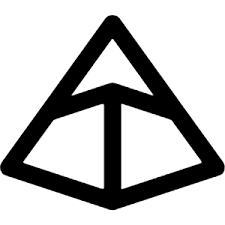
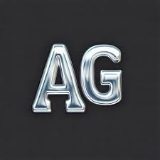
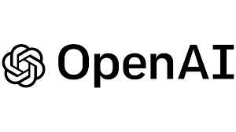

  
  
  <!-- Name and Title -->
  <h1>👋 Hi, I'm <strong>Bhaiya Singh</strong></h1>
  
  <h3>Data Scientist @ Nagarro | Generative AI Enthusiast | Tech Blogger</h3>
  
  
<strong><em>Transforming complex data into actionable insights</em></strong>

  
  <!-- Location and Role Badges -->
  

    
    
  

  
  <!-- Social Links -->
  

    
    
    
    
  

  

---

  <h2>🚀 About Me</h2>

  
  
  
  

<ul>
  <li><strong>What I do</strong>: Build production-ready ML/GenAI solutions and share practical learnings through blogs.</li>
  <li><strong>Interests</strong>: LLM agents, RAG security, evaluation, and reliable deployment.</li>
</ul>

---

  <h2>💡 Featured Work & Thought Leadership</h2>

### 📝 Technical Blogs & Articles

I write extensively about **AI, LLMs, and cutting-edge technology**. Check out my work:

#### 🌐 Self-Hosted Blogs
- **[🔧 Tech Restructuring — How AI is Rebuilding Industries](https://bhaiyahns45.github.io/My-Blogs/)** - Exploring how AI transforms industries
- **[🍌 Nano Banana Pro: Google's Revolutionary Image Generation Model](https://bhaiyahns45.github.io/My-Blogs/)** - Deep dive into Google's latest AI innovation

#### ✍️ Medium Articles
- **[🧠 How I Passed the Databricks Generative AI Engineer Associate Exam](https://medium.com/@bhaiyasingh/)**
- **[🔐 Integrating SharePoint Data with Your RAG Chatbot: Two Approaches for Secure Access](https://medium.com/@bhaiyasingh/)**

<b>Show more Medium posts</b>

- **[🐜 How Ants Can Solve Complex Business Problems: Ant Colony Optimization](https://medium.com/@bhaiyasingh/)**
- **[🚨 Understanding Prompt Injection: A Real-World Guide to a Growing Threat](https://medium.com/@bhaiyasingh/)**
- **[💡 Introducing GPT-40 Mini: Cost-Efficient AI vs GPT-4o](https://medium.com/@bhaiyasingh/)**
- **[🛠️ Customizing LLMs with Your Data: Best Methods](https://medium.com/@bhaiyasingh/)**
- **[🚧 Top 5 Challenges in Deploying LLM Agents to Production](https://medium.com/@bhaiyasingh/)**

**📚 Read all my blogs:** [Blog Hub](https://bhaiyahns45.github.io/My-Blogs/) | [Medium Profile](https://medium.com/@bhaiyasingh/)

---

  <h2>🏆 Achievements & Awards</h2>

### 🎖️ Nagarro Awards
- **The Brightest Mind** – June 2023, Apr 2025 (Nagarro Best Employee Award)
- **CARING CheerBoard** – Oct 2022, Feb 2024, Jan 2025 (Nagarro Best Projects Award)
- **The Rookie** – July 2022 (Nagarro Best Freshers Award)

---

  <h2>📜 Certifications</h2>

### 🎓 Professional Certifications

<em>Tip: hover on a badge to see the full certification name (tooltip), click to open the credential.</em>

#### 🤖 Generative AI & Machine Learning
<table>
  <tr>
    <td align="center">
      
    </td>
    <td align="center">
      
    </td>
    <td align="center">
      
    </td>
  </tr>
</table>

#### ☁️ Microsoft Azure Certifications
<table>
  <tr>
    <td align="center">
      
    </td>
    <td align="center">
      
    </td>
    <td align="center">
      
    </td>
  </tr>
</table>

#### ☁️ AWS Certification

<b>📋 View All Certifications (Click to expand)</b>

#### Detailed Certification Links:

1. **[Databricks Certified: Generative AI Engineer Associate](https://credentials.databricks.com/27e3f1fc-432c-4ffe-b0a6-46601051f4d8#acc.Vcuf8avp)**
   - Validated expertise in building and deploying generative AI solutions

2. **[Databricks Certified: Machine Learning Associate](https://credentials.databricks.com/2c63a8c6-229d-431b-8894-da349420c73d)**
   - Demonstrated proficiency in machine learning workflows on Databricks

3. **[DeepLearning.AI: Multi AI Agent Systems with CrewAI](https://learn.deeplearning.ai/accomplishments/ce306b37-ba98-4dd5-bf95-f0c83ef13e6c?usp=sharing)**
   - Completed comprehensive course on building multi-agent AI systems

4. **[Microsoft Certified: Azure Data Scientist Associate (DP-100)](https://www.credly.com/badges/c9f533e8-6c77-4876-b841-457fd7032bec/public_url)**
   - Certified in designing and implementing data science solutions on Azure

5. **[Microsoft Certified: Azure AI Fundamental (AI-900)](https://www.credly.com/badges/068e934e-def2-43d4-8dba-8f208da9470a/public_url)**
   - Fundamental knowledge of Azure AI services and capabilities

6. **[Microsoft Certified: Azure Fundamental (AZ-900)](https://www.credly.com/badges/b253c4c8-b41c-42eb-9a35-095121cccfec/public_url)**
   - Core understanding of Azure cloud services and solutions

7. **[AWS Certified: Cloud Practitioner (CCP)](https://www.credly.com/badges/b253c4c8-b41c-42eb-9a35-095121cccfec/public_url)**
   - Foundational knowledge of AWS cloud platform

---

  <h2>🛠️ Tech Stack & Tools</h2>

<table>
  <tr>
    <td width="50%" valign="top">
      <h3>Programming & Data Science</h3>
      

        
        
        
        
      

    </td>
    <td width="50%" valign="top">
      <h3>Cloud & Infrastructure</h3>
      

        
        
        
        
      

    </td>
  </tr>
  <tr>
    <td width="50%" valign="top">
      <h3>Databases & Caching</h3>
      

        
        
        
      

    </td>
    <td width="50%" valign="top">
      <h3>Web Frameworks</h3>
      

        
        
      

    </td>
  </tr>
</table>

<table>
  <tr>
    <td width="50%" valign="top">
      <h3> Advanced Agent Frameworks</h3>
      <table>
        <tr>
          <td valign="top">
             <strong>LangChain</strong>
          </td>
          <td valign="top">
             <strong>LangGraph</strong>
          </td>
        </tr>
        <tr>
          <td valign="top">
             <strong>Google ADK</strong>
          </td>
          <td valign="top">
             <strong>Pydantic</strong>
          </td>
        </tr>
        <tr>
          <td valign="top">
             <strong>Crew AI</strong>
          </td>
          <td valign="top">
             <strong>AutoGen</strong>
          </td>
        </tr>
        <tr>
          <td valign="top" colspan="2">
             <strong>OpenAI's Agent SDK (Formally Swarm)</strong>
          </td>
        </tr>
      </table>
    </td>
    <td width="50%" valign="top">
      <h3>🛠️ SDLC Tools</h3>
      <table>
        <tr>
          <td valign="top">
             <strong>GitHub Copilot</strong>
          </td>
          <td valign="top">
             <strong>Cursor AI</strong>
          </td>
        </tr>
        <tr>
          <td valign="top">
             <strong>Claude Code</strong>
          </td>
          <td valign="top">
             <strong>Gemini CLI</strong>
          </td>
        </tr>
        <tr>
          <td valign="top" colspan="2">
             <strong>Windsurf AI</strong>
          </td>
        </tr>
      </table>
    </td>
  </tr>
</table>

---

  <h2>🤝 Let's Connect</h2>
  
I'm always open to discussing AI, Data Science, or potential collaborations!

  
  
  
  
  
  

---

  

    
  

  
⭐️ From <a href="https://github.com/Bhaiyahns45">Bhaiyahns45</a>

---

  
© 2025 All rights reserved <strong>Bhaiya & Company</strong>

